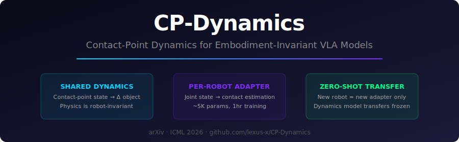
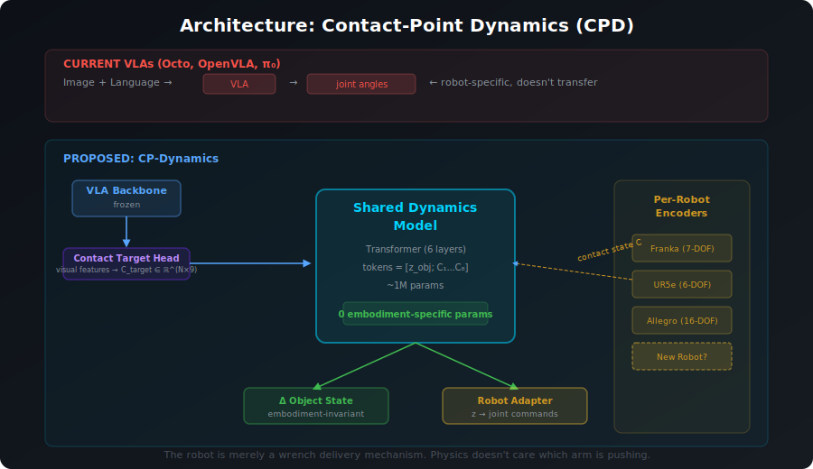
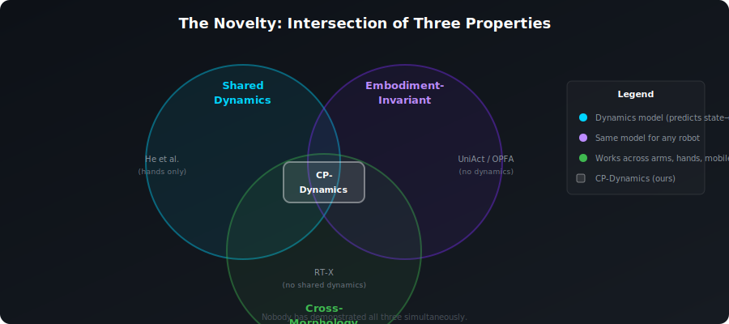

<p align="center">
  
</p>

<p align="center">
  <a href="#"></a>
  <a href="#"></a>
  <a href="LICENSE"></a>
  <a href="#"></a>
  <a href="#"></a>
</p>

---

## The Thesis

> **Environment dynamics are robot-invariant.** The physics of "what happens to an object when it is contacted" is determined by the contact interaction itself — not by which robot produced it.

When *any* robot manipulates an object, the object's motion is governed by **three things only**:

1. **Where** on the object surface contact occurs
2. **What wrench** (force/torque) is applied at each contact
3. **The object's own state** (pose, shape, mass, friction)

The robot's joint count, link lengths, actuator types, and kinematic structure are **irrelevant** to the object dynamics once contact is established. The robot is merely a **wrench delivery mechanism**.

<p align="center">
  
</p>

---

## Why This Matters

<p align="center">
  
</p>

The cross-embodiment VLA landscape in 2025–2026 has three approaches:

| Approach | Shares Perception | Shares Dynamics | Cross-Morphology |
|:---|:---:|:---:|:---:|
| **Co-training** (RT-X, Octo, π₀) | ✅ | ❌ | Partial |
| **Universal actions** (UniAct, OPFA) | ✅ | ❌ | ✅ |
| **Cross-embodiment world models** (He et al.) | ✅ | ✅ | ❌ (hands only) |
| **CP-Dynamics (ours)** | ✅ | **✅** | **✅** |

**Nobody has demonstrated all three simultaneously.** He et al. (2025) conjecture "environment dynamics are embodiment-invariant" but only prove it for dexterous hands. UniAct and OPFA share action spaces but not dynamics. RT-X shares perception but not dynamics.

---

## The Mechanism

### Contact-Point State (the embodiment-invariant representation)

```
C ∈ ℝ^(N×9)    N = max 8 contact points

Each row:
  p_c ∈ ℝ³     contact position on object surface (object frame)
  f_c ∈ ℝ³     applied force vector (object frame)
  n_c ∈ ℝ³     contact normal + slip indicator
```

A 7-DOF arm making one contact and a 16-DOF hand making three contacts both populate different rows of the **same matrix**. The dynamics model doesn't know or care *how* the contacts were achieved.

### Shared Dynamics Model

```
Input:  contact-point state C + object state z_obj
        ↓
        Transformer Encoder (6 layers)
        tokens = [z_obj; C₁; C₂; ...; C₈]
        ↓
Output: Δz_obj  (predicted object state change)
        C'      (predicted next-step contacts)
        wrench  (net object wrench, for F=ma consistency)
```

### Per-Robot Contact Estimator

```
Input:  joint state q + joint velocities q̇ + joint torques τ
        ↓
        MLP (2 layers, 256 hidden, ~5K params)
        ↓
Output: contact-point state C ∈ ℝ^(N×9)
```

Trained in simulation with ground-truth contact data. **~1 hour per robot.**

### Transfer to New Robot

```
1. Freeze dynamics model (zero-shot)
2. Train new robot's contact estimator (~1 hour)
3. Run
```

No retraining of the dynamics model. No retraining of the VLA.

---

## The Experiment

### Setup

| Component | Choice | Why |
|:---|:---|:---|
| **Robots** | Franka Panda (7-DOF) + UR5e (6-DOF) | Different DOFs, different kinematics, same gripper type |
| **Environment** | ManiSkill3 (SAPIEN) | 20+ robots, same-task-swap via `gym.make(robot=...)`, 30K+ FPS |
| **Task** | PushCube-v1 | Simple dynamics, clear success metric |
| **Data** | 2000 trajectories/robot, scripted policy | ~30 min wall-clock |
| **Compute** | ~4 hours on 1× A100 | Accessible |

### Three Models (controlled comparison)

| Model | Training Data | What it tests |
|:---|:---|:---|
| M_Franka | Franka only (2000 traj) | Upper bound |
| M_UR5e | UR5e only (2000 traj) | Upper bound |
| **M_mixed** | **Both (4000 traj, shuffled)** | **The hypothesis** |

### Pre-Registered Success Criteria

| Criterion | Threshold | Meaning |
|:---|:---|:---|
| **Transfer Ratio** | ≤ 1.15 | Mixed model ≤15% worse than single-robot |
| **Wrong-robot fails** | MSE > 2× baseline | Robot-specific models DON'T transfer |
| **Latent alignment** | cosine > 0.7 | Shared latent space captures same dynamics |

**Pass:** All three met → full-scale VLA training justified.
**Fail:** Any fails → redirect to robot-specific representations.

### Metrics

```
Transfer Ratio = MSE(mixed→Franka) / MSE(Franka→Franka)

Latent Alignment = cosine_sim(z_{t+1} - z_t)_Franka, (z_{t+1} - z_t)_UR5e)
                   for matched pushing scenarios (same cube pose, same push direction)
```

---

## Quick Start

```bash
git clone https://github.com/lexus-x/CP-Dynamics.git
cd CP-Dynamics
pip install -e .

# 1. Generate data (~30 min)
python scripts/generate_data.py --robot panda --episodes 2000
python scripts/generate_data.py --robot ur5e --episodes 2000

# 2. Train contact estimators (~1 hour)
python scripts/train_contact_estimator.py --robot panda
python scripts/train_contact_estimator.py --robot ur5e

# 3. Train dynamics models (~2 hours)
python scripts/train_dynamics.py --data mixed --epochs 100
python scripts/train_dynamics.py --data franka_only --epochs 100
python scripts/train_dynamics.py --data ur5e_only --epochs 100

# 4. Evaluate
python scripts/evaluate.py --model mixed --robot franka
python scripts/evaluate.py --model mixed --robot ur5e
python scripts/evaluate.py --model franka_only --robot ur5e  # wrong-robot baseline
```

---

## Project Structure

```
CP-Dynamics/
├── assets/
│   ├── banner.svg              # Project banner
│   ├── architecture.svg        # Architecture diagram
│   └── venn.svg                # Novelty Venn diagram
├── docs/
│   ├── PROPOSAL.md             # Full research proposal
│   ├── LITERATURE.md           # Exhaustive literature review
│   ├── EXPERIMENT.md           # Detailed experiment protocol
│   └── THEORY.md               # Theoretical motivation
├── src/
│   ├── dynamics/
│   │   ├── __init__.py
│   │   ├── model.py            # Shared dynamics model (Transformer)
│   │   ├── contact_encoder.py  # Per-robot contact estimators
│   │   └── losses.py           # Dynamics + physics consistency losses
│   └── utils/
│       └── visualization.py    # Latent space visualization
├── scripts/
│   ├── generate_data.py        # Data collection in ManiSkill3
│   ├── train_contact_estimator.py
│   ├── train_dynamics.py
│   └── evaluate.py
├── tests/
│   └── test_dynamics.py
├── setup.py
├── LICENSE
└── README.md
```

---

## Requirements

- Python 3.10+
- PyTorch 2.0+
- ManiSkill3 (`pip install mani_skill`)
- SAPIEN (physics engine, installed with ManiSkill)
- GPU with ≥16GB VRAM (for training)

---

## Citation

```bibtex
@article{cpdynamics2026,
  title={CP-Dynamics: Contact-Point Dynamics for Embodiment-Invariant Vision-Language-Action Models},
  author={lexus-x},
  year={2026},
  url={https://github.com/lexus-x/CP-Dynamics}
}
```

---

## Related Work

| Paper | Date | Venue | Key Insight |
|:---|:---|:---|:---|
| He et al. — Cross-Embodiment World Models | Nov 2025 | arXiv | Particle dynamics for dexterous hands. "Dynamics are embodiment-invariant." |
| UniAct | Jan 2025 | CVPR 2025 | Universal action space with per-embodiment decoders |
| OPFA | Mar 2026 | ICRA 2026 | Geometry-aware latent actions, unified decoder, 11 end-effectors |
| UniVLA | May 2025 | RSS 2025 | Task-centric latent actions from video |
| X-VLA | Oct 2025 | ICLR 2026 | Soft-prompted cross-embodiment |
| Data Analogies (Finn) | Mar 2026 | CoRL 2026 | Paired demos matter for morphology transfer |
| FAST/π₀-FAST | Jan 2025 | RSS 2025 | Universal action tokenizer |
| RT-X / Open X-Embodiment | Oct 2023 | ICRA 2024 | Co-training on 22 robots |

---

## License

[MIT](LICENSE)
